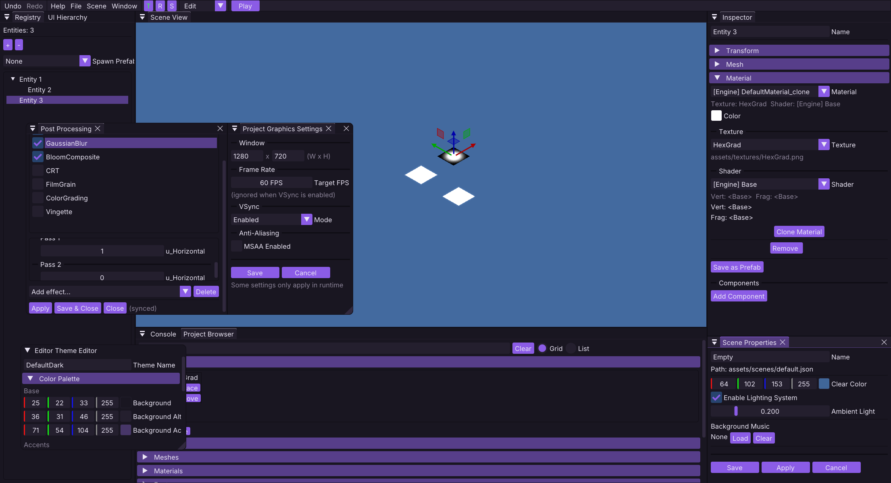

# The Obliberry Game Engine

A Fallout-inspired isometric game engine for hex-grid games, written in C++20 with OpenGL. It includes a visual
editor, an ECS core, [its own scripting language](https://github.com/torkelicious/ObSL), lazy asset loading, and
single-file project-data packaging.

> **Note:** Obliberry is still in active development. Scripting APIs, file formats, and the ObSL language can change.

## Quick start

Download the latest prebuilt binaries from
**the [releases page](https://github.com/torkelicious/obliberry/releases/latest).**
They come with the editor, runtime, tools, and project templates. Unzip and run `obliberry_editor` to get started.

### [How to use the editor](docs/editor/usage.md)

Want a look at something made with the engine? There is also a prebuilt Demo project at the
[demo release](https://github.com/torkelicious/obliberry/releases/tag/demo): download the version for your OS and run
the `DemoProject` executable.

To build the engine from source instead, see the [build instructions](docs/build.md).

> **Note:** Obliberry is primarily developed and tested on Linux. Windows is tested less frequently, and macOS is
> currently untested, but expected to work.

## Features

- Visual editor with Hub, Edit, Play, and Map Edit modes, transform and collider gizmos, pixel-based entity picking,
  hierarchy editing, undo/redo, and project asset management.
- ECS core with versioned entity handles, dense component pools, parent-child relationships, prefabs, and persistent
  entities across scene transitions.
- Pointy-top hex-grid maps using odd-r coordinates, a compact `.obmap` format, built-in A* pathfinding, and a dedicated
  map editor.
- Sprite-sheet animation with named clips, per-frame timing, configurable sheet spacing, editor previews, and ObSL
  playback control.
- Collider shapes for flat and 3D-style isometric objects, including collision and trigger enter/stay/exit events.
- Project-wide `assets.json` catalog with lazy loading, dependency resolution, and automatic unloading when scenes
  change.
- Configurable post-processing chains with custom fragment shaders, editable uniforms, multi-pass effects, bloom, CRT,
  color effects, and live editor previews.
- ObSL scripting with hot reload, parallel execution, deferred thread-safe mutations, lifecycle hooks, collision
  events, UI access, and scene management.
- Instanced OpenGL rendering with directional sprites, billboards, picking, particles, lighting, and scene UI.
- Audio support for sound effects and looping music.
- Export project data into a single LZ4-compressed `.obpak` with MessagePack JSON and pre-parsed ObSL scripts.

## How it works

Obliberry splits the main loop from rendering: the main thread updates game logic, ECS systems, and scripts, submits a
frame, and hands it to a dedicated render thread with its own GL context. Frames are double-buffered at the frame level,
so the main thread prepares the next frame while the previous one is still being drawn. ObSL scripts run in parallel
across a thread pool, one interpreter per worker, but they cannot mutate the ECS directly: writes are routed through
command buffers that the main thread flushes, which keeps parallel scripts safe without locking every component access.

Project assets are registered once in the project-root `assets.json` catalog. Scenes and prefabs store resource IDs
instead of duplicating complete definitions. When a scene loads, Obliberry scans its asset references, resolves
dependencies such as material textures and animation sheets, and loads only the required subset. Scene-owned asset
scopes release resources that are no longer needed when switching scenes.

Hex maps use an odd-r offset layout with pointy-top hexes, a compact binary format (`.obmap`), and A* pathfinding over
the grid. Exported project data is packaged into a single `.obpak` file containing a header, a table of contents, a
string table, and an LZ4-compressed blob. Scripts are pre-parsed at pack time and stored as serialized ASTs, so a
packaged game skips parsing on startup. Media files are stored uncompressed by design because compressing textures and
audio rarely pays off.

## Credits and thanks

Open-source projects used:

| Project                                                                                                                                                                                  | Where it is used                                                |
|------------------------------------------------------------------------------------------------------------------------------------------------------------------------------------------|-----------------------------------------------------------------|
| [ObSL](https://github.com/torkelicious/ObSL)                                                                                                                                             | The embedded scripting language (submodule, MIT), made by me :D |
| [GLAD](https://github.com/Dav1dde/glad)                                                                                                                                                  | OpenGL loader                                                   |
| [GLFW](https://github.com/glfw/glfw)                                                                                                                                                     | Window and input                                                |
| [GLM](https://github.com/g-truc/glm)                                                                                                                                                     | Math                                                            |
| [stb_image](https://github.com/nothings/stb/tree/master)                                                                                                                                 | Image loading                                                   |
| [Dear ImGui](https://github.com/ocornut/imgui)                                                                                                                                           | Editor UI                                                       |
| [ImGuizmo](https://github.com/CedricGuillemet/ImGuizmo)                                                                                                                                  | Gizmo transforms                                                |
| [nlohmann/json](https://github.com/nlohmann/json)                                                                                                                                        | JSON serialization                                              |
| [miniaudio](https://github.com/mackron/miniaudio)                                                                                                                                        | Audio                                                           |
| [nativefiledialog-extended](https://github.com/btzy/nativefiledialog-extended)                                                                                                           | File dialogs                                                    |
| [FreeType](https://github.com/freetype/freetype)                                                                                                                                         | Font rendering                                                  |
| [Open Sans](https://github.com/googlefonts/opensans)                                                                                                                                     | Demo project UI font (SIL OFL 1.1)                              |
| More fonts from [Google Fonts](https://fonts.google.com/) are bundled with their licenses, see [resources/fonts/](https://github.com/torkelicious/obliberry/tree/master/resources/fonts) | Editor UI text                                                  |
| [LZ4](https://github.com/lz4/lz4)                                                                                                                                                        | `.obpak` compression                                            |

Full license texts for the above: [THIRD_PARTY_LICENSES.md](docs/THIRD_PARTY_LICENSES.md).

Learning resources that shaped the codebase:

* [LearnOpenGL](http://learnopengl.com/) and [docs.gl](https://docs.gl/) for OpenGL.
* [Red Blob Games](https://www.redblobgames.com/grids/hexagons/) for hex grid math.
* [Crafting Interpreters](https://craftinginterpreters.com/contents.html) for the ObSL interpreter.
* [A Quick Guide to Interpreter Design in Modern C++](https://simplifycpp.org/books/cpp/Quick_Guide_to_Interpreter_Design_by_Modern_CPP.pdf)
  by Ayman Alheraki, for the ObSL interpreter.
* For the
  ECS: [C++ Game Engine Design: Basics to Advanced](https://codezup.com/cpp-game-engine-design-basics-advanced/),
  [A Simple Entity Component System (ECS) [C++]](https://austinmorlan.com/posts/entity_component_system/),
  [An Entity Component System from Scratch](https://www.codingwiththomas.com/blog/an-entity-component-system-from-scratch),
  and
  [Making a Simple ECS](https://www.david-colson.com/2020/02/09/making-a-simple-ecs.html).
* [rgbguy's framebuffer picking guide](https://rgbguy.in/blogs/object-picking.html) for entity picking.

Assets: the textures in the demo project were drawn in GIMP by me, and the music was also made by me.

Big thanks to all of these great open-source projects and resources for making this learning project possible :)

## Documentation

Full documentation lives
in [docs/](docs/index.md): [build instructions](docs/build.md), [editor guide](docs/editor/usage.md),
[architecture notes](docs/architecture.md), the [ObSL scripting guide](docs/scripting/getting-started.md) and
[API reference](docs/scripting/api-reference.md), the [`assets.json` catalog](docs/formats/assets-json.md), and
[file format specs](docs/formats/project-json.md).

Licensed under the MIT License. See [LICENSE](LICENSE).
