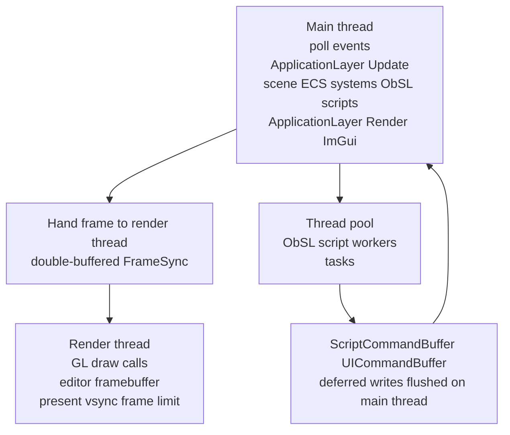

# Architecture

This page explains how Obliberry is organized: the runtime and its threading model, the ECS core, and each module under
`src/`.

## At a glance

```
src/
├── Core/           Application, main loop, EngineContext, Project, ResourceManager
├── Config/         project.json and graphics.json configuration structs
├── ECS/            Entity-component-system: Registry, components, systems
├── IO/             VFS, scene/map serialization, loaders, .obpak packaging
├── Logger/         Logging service and LOG_* macros
├── Map/            Hex grid model (HexCoords, HexGrid + A* pathfinding)
├── Math/           Hex math, general math, frustum
├── Platform/       Window (GLFW), input, thread pool
├── Rendering/      OpenGL renderer, camera, meshes, materials, shaders, lightmaps
├── Scenes/         Scene and SceneManager
├── Scripting/      ObSL EngineLib (the script engine bindings)
├── Sound/          AudioEngine (miniaudio wrapper)
├── UI/             Scene UI system: elements, renderer, fonts
└── Applications/   Executables: Editor, Runtime, packaging tools
```

## The runtime

Both executables (`obliberry_runtime` and `obliberry_editor`) are thin shells around the same core:

1. `main()` mounts a project or package through the VFS, deserializes `project.json` / `graphics.json`, and constructs a
   `Core::Application` with an `ApplicationLayer` (`Game::GameLayer` for the runtime, `Editor::EditorLayer` for the
   editor).
2. `Application::Run()` owns the window, input manager, script pool, thread pool, audio engine, and UI renderer, then
   enters the main loop.



### Main loop (`src/Core/Application.cpp`)

* The **main thread** polls input, updates the active layer (game logic, ECS systems, scripts), renders the layer
  (submitting render commands and ImGui), then hands the finished frame to the render thread.
* Rendering is **double-buffered at the frame level**: `m_Frames[2]` alternate between
  `Free → Ready → Rendering → Free`. The main thread writes into one buffer while the render thread draws the other;
  when both are busy, the main thread blocks until a buffer frees up.
* The **render thread** (`RenderThreadWorker`) has its own GL context. It waits for a `Ready` frame, flushes the
  submitted render commands and UI, draws ImGui, swaps buffers, and applies VSync / the `targetfps` frame limiter (the
  limiter only runs when VSync is off). In editor mode the scene is drawn into an editor framebuffer (used by the
  viewport and for entity picking).
* `EngineContext` is a plain struct of pointers handed to layers and modules it is how systems reach the window, input,
  renderer, camera, resources, scene manager, script pool, thread pool, audio engine, and time data.

## Threading model

| Thread              | Responsibility                                                                  |
|---------------------|---------------------------------------------------------------------------------|
| Main                | Input, scene update (ECS systems), script dispatch, UI/ImGui, frame submission  |
| Render              | All GL calls: command flush, framebuffer, present                               |
| Thread pool workers | Parallel script execution and general tasks (`Platform::Threading::ThreadPool`) |

* The thread pool sizes itself to `hardware_concurrency - 2` (2 threads are reserved for main + render; see
  `Core::ReservedThreads`).
* ObSL scripts run **in parallel** across the script pool's workers (one interpreter per worker). Each entity's scripts
  are assigned to a worker round robin.
* Scripts must not mutate the ECS directly from a worker: the EngineLib routes mutations through `ScriptCommandBuffer` /
  `UICommandBuffer`, which the main thread flushes after parallel execution. Reads are protected by a shared registry
  mutex (`g_RegistryMutex`). Module-specific state (camera, audio, window, …) has its own mutexes.

See [Scripting : Getting Started](scripting/getting-started.md) for the scripting model,
and [Scripting : API Reference](scripting/api-reference.md) for notes per module.

## ECS (`src/ECS`)

* **Registry** : owns entity pools (`ComponentPool<T>`, dense arrays) with a fixed cap on component types (
  `MAX_COMPONENT_TYPES`) and a maximum entity count. Entity handles are *versioned* (
  `index | version << ENTITY_VERSION_SHIFT`) so stale handles don't alias new entities. `ForEach<Primary, Rest...>`
  iterates entities that have all listed components.
* **Entity** : a lightweight handle wrapper (`{EntityID, Registry*}`) with
  `AddComponent/GetComponent/HasComponent/RemoveComponent`, naming, and hierarchy helpers.
* **Components** (`src/ECS/Components/`) : `TransformComponent`, `MeshComponent`, `MaterialComponent`,
  `ScriptComponent`, `MovementComponent`, `MapComponent`/`MapStateComponent`, `PointLightComponent`,
  `ParticleEmitterComponent`, `DirectionalTextureComponent`, `BillboardTagComponent`, `DestroyTagComponent`,
  `PrefabSourceComponent`, `RelationshipComponent` (hierarchy), `CustomDataComponent` (script data).
* **Systems** (`src/ECS/Systems/`) : `RenderSystem`, `ScriptSystem`, `MovementSystem`, `MapRenderSystem`,
  `MapRuntimeSystem`, `LightingSystem`, `ParticleSystem`, `AISystem`, `PlayerControlSystem`, `HierarchySystem`,
  `DirectionalAnimationSystem`, `SpriteBillboardSystem`.

## Rendering (`src/Rendering`)

* OpenGL forward renderer via GLAD. The camera is orthographic with an isometric-style rotation (tilt `angleX`, rotate
  `angleZ`) and zoom (`Rendering::Camera`).
* Per frame the renderer collects `RenderCommand`s and `InstancedRenderCommand`s, merges them into batches by
  mesh/material/texture/color/shape, and flushes them on the render thread. It supports instanced rendering,
  per-instance colors, blend modes, and `renderOrder`.
* Resources: `Mesh` (with `MeshFactory` procedural factories such as `Quad`, `Hexagon`, `Circle`, `Ring`,
  `PointTopHex`), `Material`, `Texture`, `Shader`, `Lightmap`, `FrameBuffer` (editor viewport + picking),
  `ParticlePool`.
* Editor picking is done by reading the pixel from an entity-ID framebuffer attachment.

## Scripting (`src/Scripting`)

* The engine embeds **ObSL** (submodule at `external/obsl`) language with its own docs (`external/obsl/docs/`).
* `Scripting::EngineLib` registers the script-visible API in nine modules: Core, Registry, Input, Camera, Map, Audio,
  Scene Management, Time, and UI.
* `ECS::Systems::ScriptSystem` pre-parses and runs entity scripts, binds the `this` entity wrapper, calls `on_update`/
  `on_destroy`/`on_exit` hooks in parallel, hot-reloads scripts when their source changes (loose projects only), and
  defers registry mutations to the main thread.

→ [Getting started](scripting/getting-started.md) · [API reference](scripting/api-reference.md)

## Scenes (`src/Scenes`)

* A `Scene` owns an `ECS::Registry`, a `UI::UISystem`, and `SceneProperties` (name, clear color, ambient light,
  background music).
* `SceneManager` handles create/switch/save/load, including deferred scene changes (`pendingScenePath` , scripts call
  `LoadScene(...)` and the engine performs the switch).
* Scenes serialize to JSON under `assets/scenes/`; see [Scene file format](formats/scene-json.md).

## IO and packaging (`src/IO`)

* **VFS** (`IO::VFS`) : mounts either a project directory (root = `project.json`'s parent) or a `.obpak` package.
  Virtual paths are project-relative (`assets/scripts/main.obsl`). A mounted package shadows the disk for reads.
* **Serialization** : `SceneSerialization` (JSON scenes), `MapSerialization` (binary `.obmap` hex maps), `UISerializer`.
* **Loaders** - `AssetLoader` (textures, shaders, meshes, materials, fonts from the scene `assets` section),
  `EntityFactory` (component deserializers/serializers), `PrefabManager`/`ParticleEmitterPrefabManager`.
* **Packaging** : `.obpak` container (header + TOC + string table + LZ4-compressed blob), plus the `ob_packer` /
  `ob_unpacker` / `obsl_pack_run` tools, `.pakignore` rules, and dependency graph validation.

→ [`.obmap`](formats/obmap.md) · [`.obpak`](formats/obpak.md) · [scene JSON](formats/scene-json.md)

## UI (`src/UI`)

* `UI::UISystem` maintains a tree of `UIElement`s rooted at a `"Canvas"` element. Elements are `UIText`, `UIButton`,
  `UIImage`, and `UIRect`, each with a `RectTransform` (position + scale in UI space) and flags (`VISIBLE`, `ENABLED`,
  `FOCUSED`).
* Hit testing walks the tree; button states (hovered/held/clicked) are snapshotted per frame for script queries.
* `UI::UIRenderer` draws the UI with its own shaders; text is rendered via FreeType (`UI::Text::Font`). The whole scene
  UI can be authored in the editor's UI panel and is serialized into the scene file
  (see [scene format](formats/scene-json.md)).

## Sound (`src/Sound`)

* `Sound::AudioEngine` wraps **miniaudio**. It provides 2D sound effects (`PlaySound2D`), looping music (`PlayMusic`/
  `StopMusic`), and a master volume control. Audio is updated once per frame on the main thread.

## Platform (`src/Platform`)

* `Window` : GLFW window wrapper (size, fullscreen, swap, polling).
* `InputManager` : keyboard (by GLFW key or named alias, e.g. `"Space"`), mouse buttons, scroll, mouse position with
  viewport-offset support, and edge-triggered pressed/released state.
* `ThreadPool` : fixed worker pool with `enqueue`/`wait` (used by script execution and other tasks).

## Logger (`src/Logger`)

* `LoggerService` holds a thread-local `ILogger`. The `LOG_INFO/LOG_WARN/LOG_ERROR/LOG_DEBUG(who, msg)` macros are the
  standard way to log.

## Configuration (`src/Config`)

* `ProjectConfig` : project-level settings (`title`, `start_scene`) from `project.json`.
* `GraphicsConfig` : window size/fullscreen, MSAA, target FPS, vsync mode, performance overlay from `graphics.json`.

→ [project.json](formats/project-json.md) · [graphics.json](formats/graphics-json.md)
