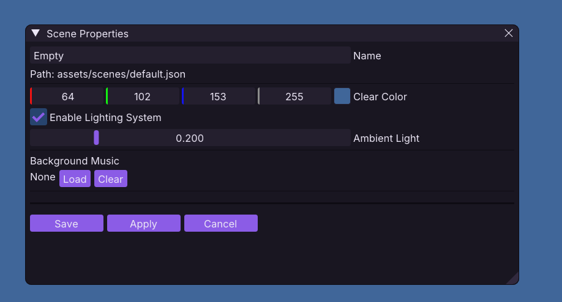

# Scenes

A **scene** is a self-contained level or screen in your project. It holds everything that exists together at one time:
the map, entities, UI, lighting, music, and references to project assets.

---

## What a Scene Contains

| Section              | Description                                                                  |
|----------------------|------------------------------------------------------------------------------|
| **Scene Properties** | Name, background clear color, background music, ambient light intensity      |
| **Registry**         | All entities and their components (Transform, Mesh, Material, Script, etc.)  |
| **Map**              | hex-grid map (stored as a `.obmap` file, referenced by the scene)            |
| **UI**               | UI element tree (text, buttons, images) !! separate from the entity Registry |
| **Post-Processing**  | Fullscreen effect chain (bloom, CRT, custom shaders)                         |

Asset definitions are project-wide and live in [`assets.json`](../formats/assets-json.md). A scene stores only the IDs
it uses.

> [!NOTE]
> Scenes are saved as JSON files under `assets/scenes/` in your project. The format is documented
> in [scene-json.md](../formats/scene-json.md) if you need the technical details.

---

## Creating & Managing Scenes

### New Scene

**Scene → New Scene** - Creates a blank scene with a default camera and empty registry.

### Switch Scenes

**Scene → Open Scene** - Lists all scenes in `assets/scenes/`. Switching saves the current scene first.

### Scene Properties

**Scene → Scene Properties** - Edit:

- **Name** - Display name (shown in the scene list)
- **Clear Color** - Background color (RGBA)
- **Background Music** - Path to music file (relative to project assets)
- **Ambient Light** - Global ambient intensity (0-1), also feeds into the map lightmap

---

## The MAP Entity

If your scene has a hex-grid map, there's a special invisible entity named **"MAP"** in the Registry. It holds:

- `MapComponent` - The loaded `.obmap` data
- `MapStateComponent` - Runtime state (selection, path highlights)

You don't edit these components directly. Use **Map Edit mode** to paint the map, and the MAP entity updates
automatically.

> [!IMPORTANT]
> The map file path is stored _in the scene_, not in the MAP entity. When you save the scene, the map reference is saved
> with it.

---

## Scene Workflow

| Task                          | How                                                                                            |
|-------------------------------|------------------------------------------------------------------------------------------------|
| **Start a new level**         | Scene → New Scene, then Map Edit mode to paint the grid                                        |
| **Reuse a map across scenes** | In Map Edit mode: Map → Save Map As... → give it a name. Then in the new scene: Map → Load Map |
| **Duplicate a scene**         | Copy the `.json` file in `assets/scenes/`, rename it, then Scene → Open Scene                  |
| **Set the starting scene**    | Edit `project.json` → `start_scene` field (relative to `assets/scenes/`)                       |

---

## Saving

- **Ctrl+S** - Save current scene (or map in Map Edit mode)
- **Scene → Save Scene As...** - Save under a specific name
- The editor prompts to save before: switching scenes, entering Play mode, exporting, or quitting

---

## Scene Loading Order

The engine loads in this order:

1. **Properties** - Reads clear color, music, and ambient light.
2. **Referenced assets** - Scans the scene's IDs, resolves material and animation dependencies through `assets.json`,
   and loads only the required subset.
3. **Grid** - Loads the `.obmap` file and creates the MAP entity.
4. **Post-Processing** - Restores the effect chain (or uses the default chain when absent).
5. **Entities** - Creates entities, adds components, then reparents children.
6. **UI** - Builds the UI element tree.

The scene retains the acquired assets for its lifetime. Switching scenes releases that scope and unloads project assets
that are no longer referenced. Persistent entities reacquire their required assets for the destination scene.

---

## Scene Persistence

Entities can be marked as **persistent** so they survive scene transitions they carry themselves over to the next scene,
and reinitialize scripts.

see: [api reference](../scripting/api-reference.md#persistence)

> [!NOTE]
> scripts are re-initalized on scene change, use ObSL custom data if you are looking to to store persitent values
> between scenes!

---

## See Also

- [Post-Processing](post-processing.md) - Editing the scene's fullscreen effect chain
- [Asset Catalog](../formats/assets-json.md) - Project-wide asset definitions and lazy loading
- [Component Reference](components.md) - All components you can add to entities
- [Map Editing](usage.md#map-edit-mode) - Painting and configuring the hex grid
- [Prefabs](prefabs.md) - Creating reusable entity templates
- [Project Structure](concepts.md#project-structure) - Where scenes live on disk
