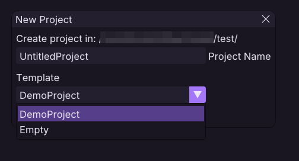
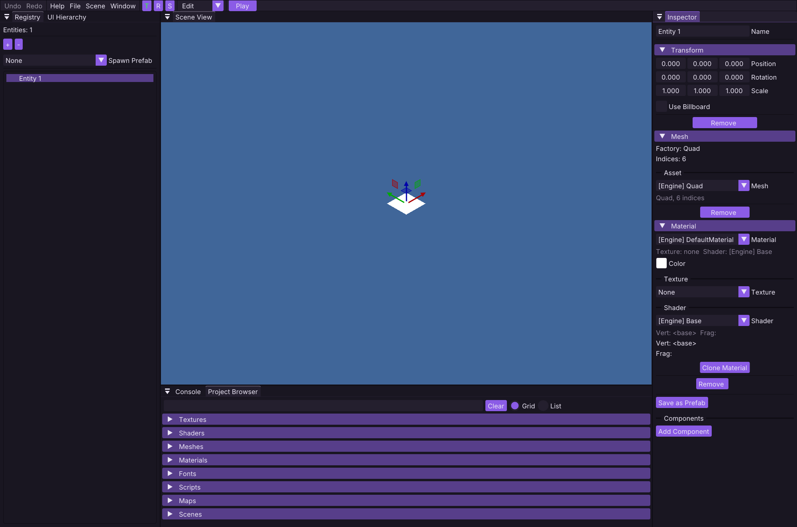
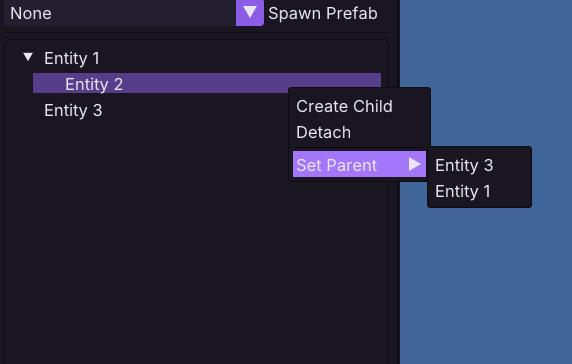
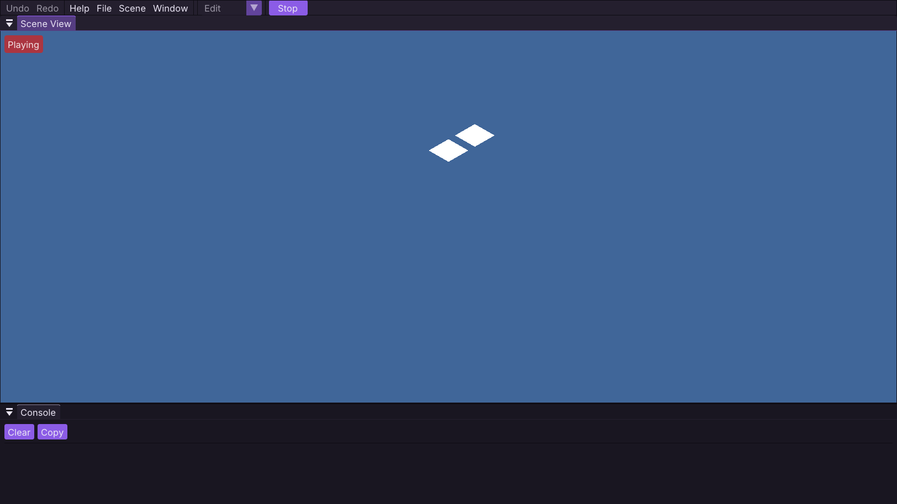
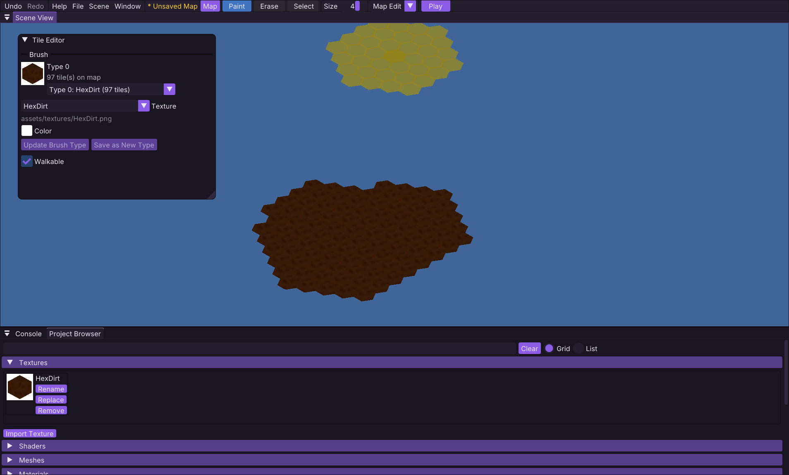

# Obliberry Editor Guide

A tour of the Obliberry editor: the modes, camera controls, panels, and keybind reference.

---

## Editor Modes

The editor has four states. You start in the Hub, and everything else hangs off it.

| State        | What it is                                                                              |
|--------------|-----------------------------------------------------------------------------------------|
| **Hub**      | The startup screen. Create or open a project.                                           |
| **Edit**     | Build your scene: entities, transforms, materials, UI. Default after opening a project. |
| **Play**     | Run the scene and its scripts, like a player would.                                     |
| **Map Edit** | Paint and edit the hex-grid map.                                                        |

> [!NOTE]
> **Switching modes:** Use the mode dropdown in the top toolbar to switch between **Edit** and **Map Edit**. The *
*Play/Stop** button next to it runs or stops the scene. Both are disabled while playing - stop Play first.

---

## The Hub

The Hub is a simple welcome screen with two buttons:

* **Create New Project** - Pick a parent folder, then give the project a name and choose a template:
    * `DemoProject` - The playable demo: a scene, a map, assets, and example scripts.
    * `Empty` - A minimal blank project.
* **Open Existing Project** - Pick the folder that contains `project.json`.

---

## Camera Controls

Camera input only works while the mouse is over the **Scene View**.

| Input                      | Action                                     |
|----------------------------|--------------------------------------------|
| `W` `A` `S` `D`            | Pan the camera                             |
| `Shift` + `WASD`           | Pan faster (3×)                            |
| Scroll wheel               | Zoom in and out                            |
| Middle or right mouse drag | Pan the camera                             |
| `V`                        | Toggle between isometric and top-down view |

The camera starts in **isometric view**. Top-down is handy when painting maps or aligning tiles.

---

## Edit Mode

Edit mode is where you build the scene. The default layout:

* **Scene View** (center) - The 3D viewport. Click an entity to select it, click empty space to deselect.
* **Registry** (left) - The scene hierarchy. `+` creates a new entity, `-` deletes the selected one. Right-click an
  entity for parenting options (Create Child, Set Parent, Detach).
* **UI Hierarchy** (left, under Registry) - Scene UI elements (text, buttons, images).
* **Inspector** (right) - Edit the selected entity's components (transform, mesh, material, and more).
* **Project Browser** (bottom) - Browse project assets like materials and textures.
* **Console** (bottom) - Log output.

Select an entity and drag the gizmo in the Scene View to move it around. The gizmo buttons in the toolbar (or the `T`
`R` `E` keys) switch between **translate**, **rotate**, and **scale**. Gizmo edits are undoable. Rotation does nothing
on billboard sprites, and the editor will tell you so.

Scenes are managed from the **Scene** menu: edit scene properties, create a new scene, or switch between scenes.

---

## Play Mode

Press `F5` (or the Play button) to run the scene. The editor prompts you to save any unsaved changes first, then reloads
the scene and runs it like the game would: ObSL scripts run, game logic ticks, and the editor panels disappear.

Stop with `F1`, `F5`, or the Stop button. The scene is reloaded from disk and the camera is restored, so anything you
changed while playing is discarded. **Play mode needs the current scene to be saved first.**

---

## Map Edit Mode

Switch the mode dropdown to **Map Edit**. If the scene has no map yet, the editor creates a default MAP entity for you.

The toolbar has three tools:

* **Paint** - Left-click to place tiles, drag to paint continuously.
* **Erase** - Left-click to remove tiles, drag to erase continuously.
* **Select** - Click a tile to inspect and edit its properties.

The **Size** slider sets the brush radius in hexes (1 to 5) and affects Paint and Erase. Use the **Tile Editor** panel
to pick which tile type to paint.

The **Map** menu lets you:

* Start a fresh empty map (prompts to save the current one first)
* Save the map (`Ctrl+S`)
* Save the map under a new name
* Load a `.obmap` file

Map edits are undoable. Maps are stored on a MAP entity in the scene, so the map file path is part of the scene and gets
saved with it.

---

## Exporting a Game

Use **File → Export Project** to package the project into a single `.obpak` file. This needs the `obliberry_runtime`
target to be built too. See the [architecture notes](../architecture.md) for how the runtime loads packaged games.

---

## Keybind Reference

### Global (any mode)

| Key      | Action                                                         |
|----------|----------------------------------------------------------------|
| `Esc`    | Quit the editor (prompts to save if there are unsaved changes) |
| `Ctrl+S` | Save the scene (or the map in Map Edit mode)                   |
| `Ctrl+Z` | Undo                                                           |
| `Ctrl+Y` | Redo                                                           |
| `F5`     | Enter Play mode, or stop it                                    |
| `F1`     | Stop Play mode                                                 |

> [!NOTE]
> Some actions cannot be undone, deleting an entity in the editor currently is not undoable, and some other stuff. but
  most editor actions are saved to the undo/redo stack. Just be carefull :)

### Edit Mode

| Key                       | Action                                                                    |
|---------------------------|---------------------------------------------------------------------------|
| `V`                       | Toggle isometric / top-down camera                                        |
| `T` `R` `E`               | Gizmo: translate / rotate / scale (`E` = scale, toolbar button shows `S`) |
| `W` `A` `S` `D`           | Pan the camera (hold `Shift` for 3× speed)                                |
| Scroll wheel              | Zoom                                                                      |
| Middle / right mouse drag | Pan the camera                                                            |
| Left click                | Select an entity in the Scene View                                        |

### Map Edit Mode

| Key                       | Action                                         |
|---------------------------|------------------------------------------------|
| `V`                       | Toggle isometric / top-down camera             |
| `W` `A` `S` `D`           | Pan the camera (hold `Shift` for 3× speed)     |
| Scroll wheel              | Zoom                                           |
| Middle / right mouse drag | Pan the camera                                 |
| Left click / drag         | Paint, erase, or select, depending on the tool |

> [!NOTE]
> Camera controls only work while the mouse is over the Scene View, and keyboard input is ignored while you are typing
 into a text field, so the editor does not steal your keystrokes.
